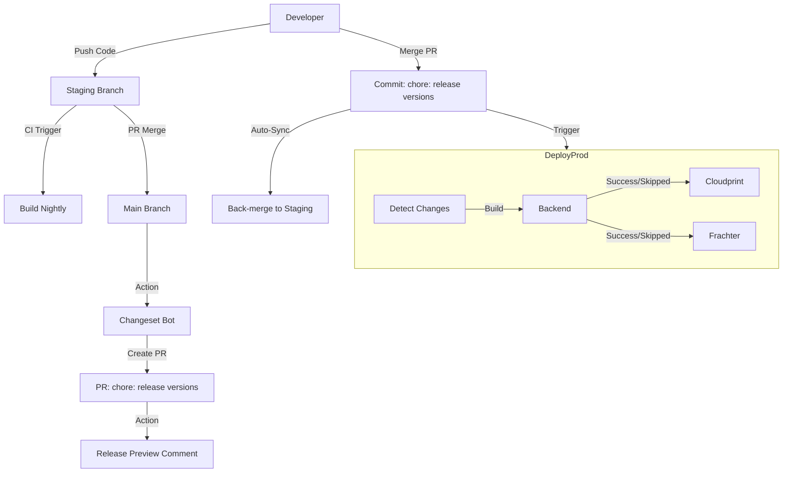

Here is the comprehensive documentation for your Monorepo Release & Deployment Strategy. You can save this as `RELEASE_ARCHITECTURE.md` in your repository.

-----

# 📦 Monorepo Release & Deployment Architecture

This document outlines the automated release flow for our monorepo (Backend, Cloudprint, Frachter). It leverages **Changesets** for version management, **Bun** for scripting, and **GitHub Actions** for orchestration.

## 1\. The High-Level Flow

We operate two distinct pipelines:

1.  **Staging (Nightly):** Push to `staging` $\rightarrow$ Immediate Build (Snapshot) $\rightarrow$ Deploy to Staging Env.
2.  **Main (Production):** Push to `main` $\rightarrow$ Version Calculation $\rightarrow$ Tag & Release $\rightarrow$ Deploy to Production Env.

<!-- end list -->



-----

## 2\. Prerequisites & Setup

### Secrets

To allow workflows to trigger other workflows (recursive triggers), you must set a Personal Access Token.

  * **`GH_PAT`**: A Classic Personal Access Token with `repo` scope. Add this to Repository Secrets.

### Environment

  * **Bun:** Used for all automation scripts.
  * **Rust:** Required on CI runners to update `Cargo.lock`.

-----

## 3\. Configuration & Scripts

### A. Root `package.json`

We hijack the standard version command to inject our Rust sync logic.

```json
{
  "scripts": {
    "version-packages": "changeset version && bun run scripts/workflows/sync-cloudprint-version"
  }
}
```

### B. [`scripts/workflows/sync-cloudprint-version.ts`](../scripts/workflows/sync-cloudprint-version.ts)

*Responsibility:* When `package.json` is bumped, this script updates `Cargo.toml`, `tauri.conf.json` and refreshes `Cargo.lock`.

### C. [`scripts/workflows/detect-release.ts`](../scripts/workflows/detect-release.ts)

*Responsibility:* Determines if the current commit is a release and which apps changed.

### D. [`scripts/workflows/preview-release.ts`](../scripts/workflows/preview-release.ts)

*Responsibility:* Generates a Markdown table for the PR comment with version numbers.

-----

## 4\. GitHub Workflows

### 1\. Release Tagger ([`.github/workflows/release-tagger.yml`](.workflows/release-tagger.yml))

Creates the "Version Packages" PR. Uses `GH_PAT` so that the PR it creates can trigger other workflows.

### 2\. Release Preview ([`.github/workflows/release-preview.yml`](.workflows/release-preview.yml))

Runs on the bot's PR to show what will be deployed.

### 3\. Production Deployment ([`.github/workflows/deploy.yml`](.workflows/deploy.yml))

The Orchestrator. Triggered by the merge of the release PR.

### 4\. Sync Staging ([`.github/workflows/sync-staging.yml`](./workflows/sync-staging.yml))

Keeps staging up to date.

-----

## 5\. Usage Guide (Day-to-Day)

### Step 1: Development

1.  Checkout `staging`.
2.  Create feature branch.
3.  Add code and run `npx changeset` to create intent file.
4.  Merge feature to `staging`. *Nightly build runs.*

### Step 2: Prepare Release

1.  Open PR `staging` $\rightarrow$ `main`.
2.  Merge PR. *No deploy yet.*

### Step 3: The Bot

1.  GitHub Actions creates a PR: **"chore: release versions"**.
2.  **Wait 1 min.**
3.  Check the **Release Preview** comment on that PR.
      * It will show: `cloudprint | 🟢 Will Deploy | v1.1.0`.

### Step 4: The Release

1.  Merge the Bot PR.
2.  **Deploy Workflow** triggers on `main`.
3.  **Sync Workflow** triggers and pushes `[skip ci]` commit to `staging`.

Your production is now live, and staging is synced for the next feature\!